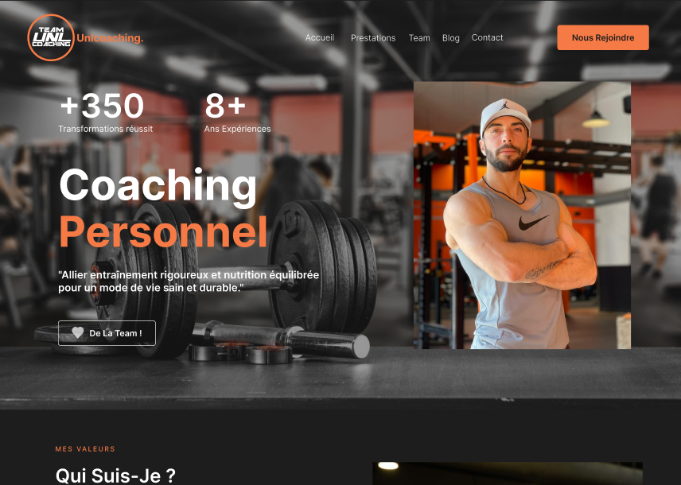

# Unlcoaching 🇫🇷

[Pre-prod](https://unlcoaching.vercel.app/)   
[Production](https://unlcoaching.com//)

------------------------------------------------

Projet Création de site web Développer avec NextJs | React  

**Presentation**

<kbd></kbd>

> PROBLEMATIQUE
Jeremy Prat est un coach sportif qui souhaite présenter son activité et ses différents services dans un site internet.
Il souhaiterait aussi crée un blog qui l'alimenterait avec des articles concernant son domain expertise actuelle, ...

> BESOIN
Création du site avec une stack complète en JavaScript avec Nextjs, React et Tailwind css.

## Livrables

> React App
- code           : [Github](https://github.com/AndyRama/project_pj_01)
- pre-production: [vercel](https://unlcoaching.vercel.app/)
- production     : [vercel](https://unlcoaching.com/)

## Compétences développées

- [x] Initialiser une application web avec un framework Nextjs
- [x] Créer des composants avec React 
- [x] Créer des différentes pages de l'application 
- [x] Utilisation de librairie externe 
- [x] création de test 
- [x] Déploiement
- [x] Module System de paiement

## Ressources

- maquette       : [Figma](https://www.figma.com/file/2HDPEwtBEbHZJSam524o6G/unlcoaching?type=design&node-id=0%3A1&mode=dev&t=xIHxkqNgPPmFc5Bh-1)
- Tableau        : [Trello](https://trello.com/b/3bd4KDlT/unlcoachingcom)

### Editeur recommandé

* [Visual Studio code](https://code.visualstudio.com/)

### Prérequis

* [Git](https://git-scm.com/) pour cloner les repos
* [NodeJS](https://nodejs.org/fr/) (version 18.18.1) pour exécuter les commandes
* [Npm](https://www.npmjs.com/) (version 6.14.17) pour lancer l'application (front-end)

### Dépendances

* [NextJs](https://nextjs.org/) (version 13.5.6)
* [React](https://legacy.reactjs.org/) (version 18)

* [Tailwind](https://www.npmjs.com/package/prop-types) (version 3.3.0)

* [React-icon](https://www.npmjs.com/package/react-icons) (version 5.0.1)
* [Contentlayer](https://www.npmjs.com/package/contentlayer) (version 0.3.4)
* [Framer-motion](https://www.npmjs.com/package/framer-motion) (version 11.0.8)
* [Swipper](https://www.npmjs.com/package/swiper/v/11.0.3) (version 11.0.3)
* [date-fns](https://www.npmjs.com/package/date-fns) (version 3.3.1)

* [Eslint](https://www.npmjs.com/package/eslint) (version 8.57.0)
* [Prettier](https://www.npmjs.com/package/prettier) (version 3.2.5)

* [Jest](https://www.npmjs.com/package/jest/v/29.6.4) (version 29.6.4)

### Etape: Lancement du project

- Cloner le repo du projet : `gh repo clone AndyRama/project_pj_01`
- Aller dans ce dossier : `cd project_pj_01 `
- Installer ses dépendances : `npm install`
- Le lancer sur le port 3000 : `npm run dev`
- Ouvrez [http://localhost:3000](http://localhost:3000) pour l'afficher dans votre navigateur.

## Fonctionnalité

- [x] Construire et déploiement de l'application

---------------------------

# Unlcoaching 🇬🇧

[Pre-prod](https://unlcoaching.vercel.app/)  
[Production](https://unlcoaching.com//)

------------------------------------------------

Website Creation Project Develop with NextJs | React

**Presentation**

<kbd></kbd>

> PROBLEMATIC
Jeremy Prat is a sports coach who wishes to present his activity and his various services on a website.
He would also like to create a blog which would provide him with articles concerning his current field of expertise, ...

> NEED
Creation of the site with a complete stack in JavaScript with Nextjs, React and Tailwind css.

## Deliverables

> ReactApp
- code: [Github](https://github.com/AndyRama/project_pj_01)
- pre-production: [vercel](https://unlcoaching.vercel.app/)
- production: [vercel](https://unlcoaching.com/)

## Skills developed

- [x] Initialize a web application with a Nextjs framework
- [x] Create components with React
- [x] Create different pages of the application
- [x] Use of external library
- [x] test creation
- [x] Deployment
- [x] Payment System Module

## Resources

- model: [Figma](https://www.figma.com/file/2HDPEwtBEbHZJSam524o6G/unlcoaching?type=design&node-id=0%3A1&mode=dev&t=xIHxkqNgPPmFc5Bh-1)
- Board: [Trello](https://trello.com/b/3bd4KDlT/unlcoachingcom)

### Recommended editor

* [Visual Studio code](https://code.visualstudio.com/)

### Prerequisites

* [Git](https://git-scm.com/) to clone repos
* [NodeJS](https://nodejs.org/fr/) (version 18.18.1) to execute commands
* [Npm](https://www.npmjs.com/) (version 6.14.17) to launch the application (front-end)

### Dependencies

* [NextJs](https://nextjs.org/) (version 13.5.6)
* [React](https://legacy.reactjs.org/) (version 18)

* [Tailwind](https://www.npmjs.com/package/prop-types) (version 3.3.0)

* [React-icon](https://www.npmjs.com/package/react-icons) (version 5.0.1)
* [Contentlayer](https://www.npmjs.com/package/contentlayer) (version 0.3.4)
* [Framer-motion](https://www.npmjs.com/package/framer-motion) (version 11.0.8)
* [Swipper](https://www.npmjs.com/package/swiper/v/11.0.3) (version 11.0.3)
* [date-fns](https://www.npmjs.com/package/date-fns) (version 3.3.1)

* [Eslint](https://www.npmjs.com/package/eslint) (version 8.57.0)
* [Prettier](https://www.npmjs.com/package/prettier) (version 3.2.5)

* [Jest](https://www.npmjs.com/package/jest/v/29.6.4) (version 29.6.4)

### Step: Launch of the project

- Clone the project repo: `gh repo clone AndyRama/project_pj_01`
- Go to this folder: `cd project_pj_01`
- Install its dependencies: `npm install`
- Run it on port 3000: `npm run dev`
- Open [http://localhost:3000](http://localhost:3000) to view it in your browser.

## Functionality

- [x] Build and deploy the application

---------------------------